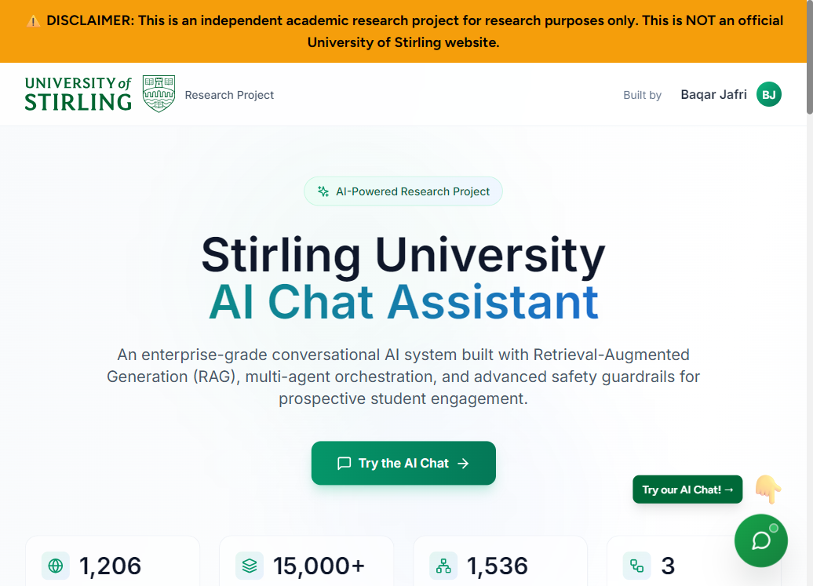
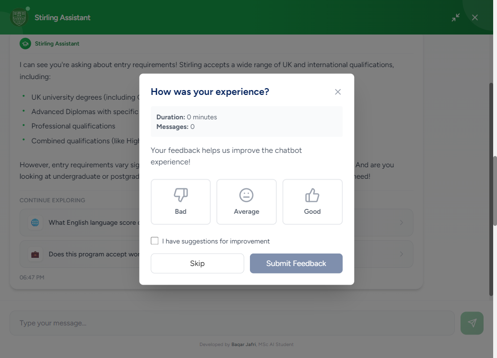
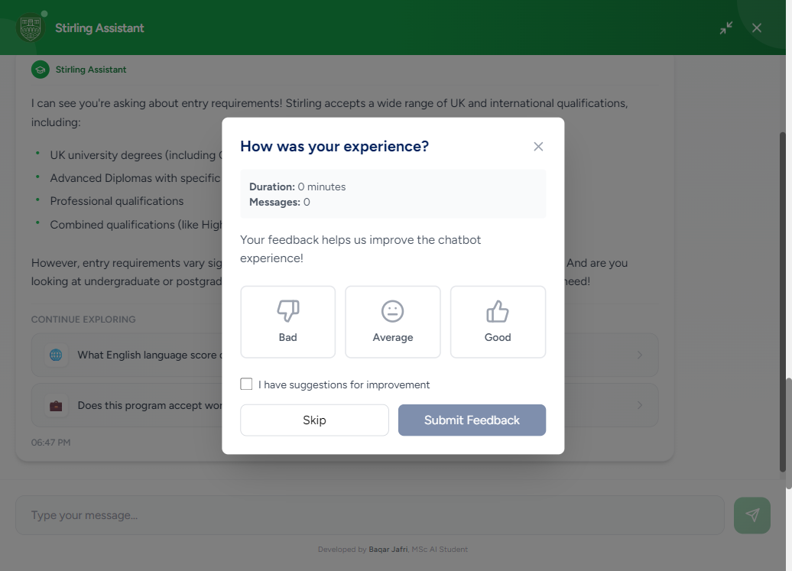
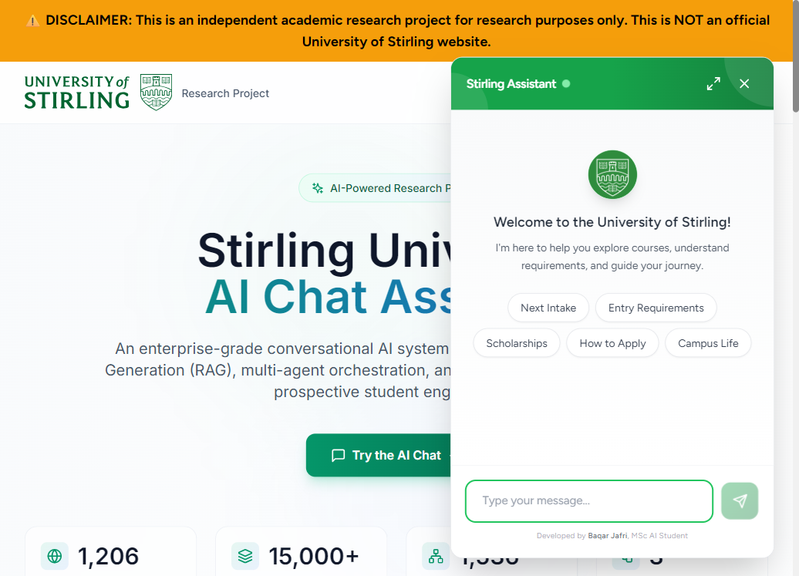
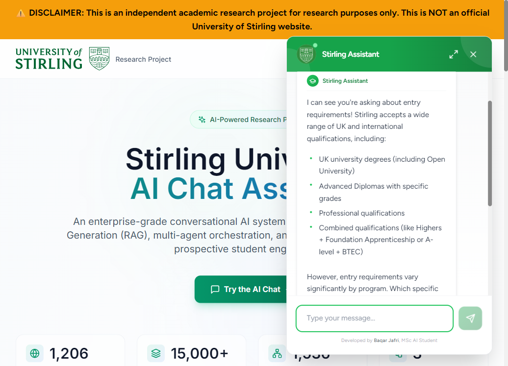
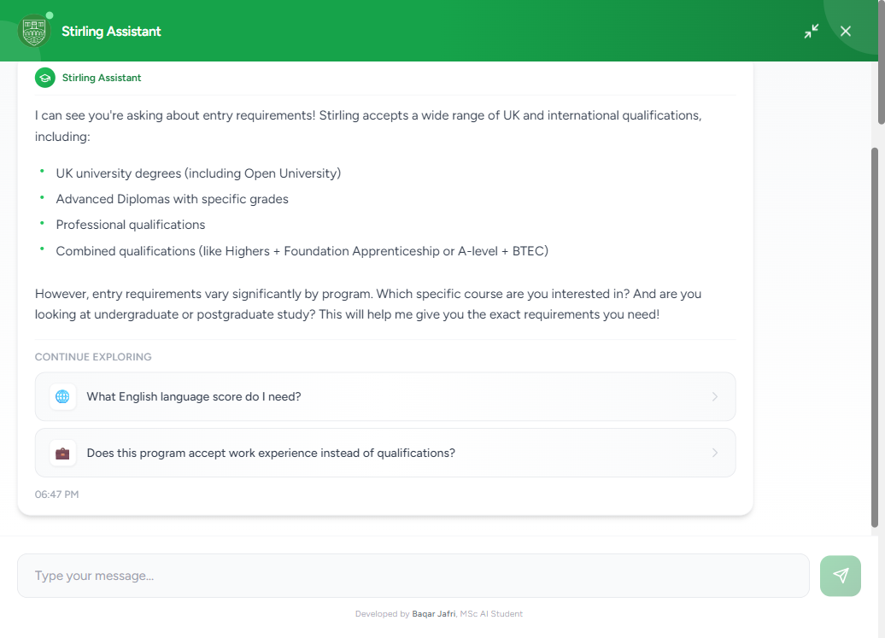

<div align="center">

# Stirling University AI Chat Assistant

**An enterprise-style RAG chatbot for prospective students — built as an independent MSc research project**

[](https://www.python.org/)
[](https://react.dev/)
[](https://fastapi.tiangolo.com/)
[](https://github.com/pgvector/pgvector)
[](https://www.anthropic.com/)
[](docs/DEMO_ARCHIVE.md)

*Retrieval-Augmented Generation · LangGraph multi-agent orchestration · Hybrid search · Safety guardrails · Lead capture*

**Author:** [Baqar Jafri](https://www.linkedin.com/in/thebaqarjafri/) · MSc AI, University of Stirling  
**Repository:** [github.com/baqarjafri/uos-chat](https://github.com/baqarjafri/uos-chat)

> ⚠️ **Research disclaimer:** This is **not** an official University of Stirling product or website. It is a proof-of-concept for academic evaluation.

</div>

---

## What this project is

A full-stack conversational AI system that answers questions about studying at the University of Stirling — courses, entry requirements, fees, scholarships, campus life, and applications — using **1,200+ scraped university pages**, **hybrid RAG retrieval**, and a **3-agent LangGraph** pipeline.

The live Railway demo has been **archived**; this README and the screenshots below are the primary showcase. You can still run everything locally (see [Quick start](#quick-start-local-development)).

<p align="center">
  
  <br/>
  <em>Landing page: project positioning, metrics, and entry to the chat widget</em>
</p>

---

## Table of contents

- [Visual tour](#visual-tour)
- [Key features](#key-features)
- [Chat experience](#chat-experience)
- [System architecture](#system-architecture)
- [Technology stack](#technology-stack)
- [At a glance](#at-a-glance)
- [Quick start (local development)](#quick-start-local-development)
- [Project structure](#project-structure)
- [API endpoints](#api-endpoints)
- [Documentation](#documentation)
- [License & disclaimer](#license--disclaimer)

---

## Visual tour

### Research landing page

The frontend is a dedicated **research showcase** (not a generic embed): hero, architecture narrative, tech stack grid, capabilities, and developer attribution — with Stirling branding and clear academic disclaimers.

| Section | Screenshot |
|---------|------------|
| **3-agent orchestration** |  |
| **Enterprise tech stack** |  |
| **Core capabilities** |  |

---

## Key features

| Area | What it does |
|------|----------------|
| **Conversational AI** | Claude 3 Haiku with session memory and formatted answers (links, bold, contact details) |
| **Hybrid RAG** | Vector search (pgvector) + BM25 keyword search with re-ranking |
| **Multi-agent flow** | Router → RAG → Lead capture via LangGraph state machine |
| **Safety guardrails** | Topic boundaries, prompt-injection checks, rate limits, incident logging |
| **Lead capture** | Progressive contact collection with journey tracking |
| **Feedback** | End-of-chat ratings (good / average / bad) with optional suggestions |
| **Production UI** | Floating widget, quick-action chips, fullscreen mode, source links |
| **Data pipeline** | FireCrawl scraping → chunking → OpenAI embeddings → PostgreSQL |

---

## Chat experience

The chat widget sits on the landing page (bottom-right), with quick topics, fullscreen mode, and RAG-backed answers citing university content.

<p align="center">
  
  &nbsp;&nbsp;
  
  <br/>
  <em>Left: welcome & quick actions · Right: live RAG answer (entry requirements)</em>
</p>

<p align="center">
  
  <br/>
  <em>Fullscreen mode for longer conversations</em>
</p>

**Chat UX highlights**

- Quick actions: Next intake, Entry requirements, Scholarships, How to apply, Campus life  
- Smart scroll: new assistant messages align to the top for readability  
- Source links to stir.ac.uk pages where relevant  
- End chat → feedback modal  
- Initial disclaimer modal (stored in browser local storage)

---

## System architecture

```
┌─────────────────────────────────────────────────────────────────┐
│  React + Vite + Tailwind  (ChatWidget, StirlingHomepage, etc.) │
└───────────────────────────────┬─────────────────────────────────┘
                                │ REST
┌───────────────────────────────▼─────────────────────────────────┐
│  FastAPI  ·  LangGraph 3-agent pipeline                         │
│  Router Agent → RAG Agent → Lead Capture Agent                  │
│  Guardrails · Rate limiting · Feedback API                      │
└───────────────────────────────┬─────────────────────────────────┘
                                │ SQL + vectors
┌───────────────────────────────▼─────────────────────────────────┐
│  PostgreSQL 16 + pgvector                                     │
│  1,206 documents · 15,000+ chunks · 13 tables · 30+ indexes    │
└─────────────────────────────────────────────────────────────────┘
```

<p align="center">
  
</p>

---

## Technology stack

<p align="center">
  
</p>

| Layer | Technologies |
|-------|----------------|
| **Frontend** | React 18, Vite, TailwindCSS, Lucide icons, Axios |
| **Backend** | FastAPI, Pydantic, Uvicorn |
| **AI** | Claude 3 Haiku, OpenAI `text-embedding-3-small`, LangGraph |
| **Data** | PostgreSQL 16, pgvector, FireCrawl |
| **Deploy (reference)** | Docker, Railway configs (`Dockerfile.railway`, `railway.toml`) |

---

## At a glance

| Metric | Value |
|--------|-------|
| University pages indexed | **1,206** |
| Text chunks | **15,000+** |
| Embedding dimensions | **1,536** |
| Database tables | **13** |
| API endpoints | **7** |
| Orchestrated agents | **3** |

---

## Quick start (local development)

### Prerequisites

- Python **3.11+**, Node **20+**, Docker Desktop  
- **OpenAI** key (embeddings) and **Anthropic** key (Claude)

### 1. Clone and configure

```bash
git clone https://github.com/baqarjafri/uos-chat.git
cd uos-chat
cp .env.example .env
# Add OPENAI_API_KEY and ANTHROPIC_API_KEY to .env
```

### 2. Database

```bash
docker-compose up -d
# PostgreSQL + pgvector on localhost:5433
```

### 3. Backend (port **8001**)

```bash
python -m venv venv
venv\Scripts\activate          # Windows
# source venv/bin/activate     # macOS/Linux
pip install -r requirements.txt
cd backend
python main.py
```

### 4. Frontend (port **3000**)

```bash
cd frontend
npm install
npm run dev
```

| Service | URL |
|---------|-----|
| App | http://localhost:3000 |
| API docs | http://localhost:8001/docs |
| Health | http://localhost:8001/health |

For Docker-based frontend: `cd frontend && docker-compose up -d`.

---

## Project structure

```
stirling_chat/
├── backend/           # FastAPI, migrate.py, Railway Dockerfiles
├── frontend/          # React UI (ChatWidget, StirlingHomepage, modals)
├── scripts/           # RAG, LangGraph, guardrails, scraping, embeddings
├── database/          # SQL schemas
├── docs/images/       # README screenshots (production capture)
├── tutorials/         # Step-by-step guides
└── docker-compose.yml # Local PostgreSQL
```

---

## API endpoints

| Method | Endpoint | Description |
|--------|----------|-------------|
| `POST` | `/chat` | Message → AI answer + sources |
| `GET` | `/conversation/{session_id}` | Conversation history |
| `POST` | `/conversation/{session_id}/end` | End session (triggers feedback) |
| `POST` | `/feedback` | Submit rating |
| `GET` | `/feedback/stats` | Aggregate feedback |
| `GET` | `/feedback/bad` | Bad feedback for review |
| `GET` | `/health` | Health + DB status |

Interactive docs: http://localhost:8001/docs (when backend is running).

---

## Documentation

| Document | Purpose |
|----------|---------|
| [docs/DEMO_ARCHIVE.md](docs/DEMO_ARCHIVE.md) | Why the live demo was retired |
| [docs/RAILWAY_TEARDOWN.md](docs/RAILWAY_TEARDOWN.md) | Remove Railway services safely |
| [DEPLOYMENT_STRUCTURE.md](DEPLOYMENT_STRUCTURE.md) | Local vs Railway file layout |
| [RAILWAY_DEPLOYMENT_GUIDE.md](RAILWAY_DEPLOYMENT_GUIDE.md) | Full deployment walkthrough |
| [PRE_DEPLOYMENT_CHECKLIST.md](PRE_DEPLOYMENT_CHECKLIST.md) | Pre-deploy checklist |
| [tutorials/stirling_chat_guide/](tutorials/stirling_chat_guide/) | In-depth technical tutorials |

---

## License & disclaimer

This project is released under the [MIT License](LICENSE) for portfolio and educational use.

It remains an **independent academic research proof-of-concept**, not affiliated with or endorsed by the University of Stirling. Do not use it for official university business or as a substitute for stir.ac.uk.

---

<div align="center">

**Built by [Baqar Jafri](https://www.linkedin.com/in/thebaqarjafri/)** · University of Stirling MSc AI  

If this README helped you understand the work, consider starring the repository.

</div>
