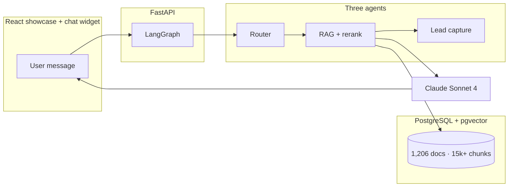

<div align="center">

# Stirling University AI Chat Assistant

### Full-stack RAG chatbot for prospective students · MSc research project

[](https://www.python.org/)
[](https://react.dev/)
[](https://fastapi.tiangolo.com/)
[](https://github.com/pgvector/pgvector)
[](https://www.anthropic.com/)
[](docs/DEMO_ARCHIVE.md)

**[Baqar Jafri](https://www.linkedin.com/in/thebaqarjafri/)** · MSc AI · University of Stirling  
**Repo:** [github.com/baqarjafri/uos-chat](https://github.com/baqarjafri/uos-chat)

> This README is the **complete portfolio walkthrough**. Screenshots, architecture, and feature breakdowns are included — you do **not** need a hosted demo to understand the project.

> ⚠️ Independent academic research — **not** an official University of Stirling service.

</div>

---

## Start here (60 seconds)

| | |
|---|---|
| **What** | AI assistant that answers questions about studying at Stirling (courses, fees, entry requirements, scholarships, campus life). |
| **How** | **Hybrid RAG** over 1,206 university web pages → **LangGraph** (router → retrieval → optional lead capture) → **Claude Sonnet 4** (`claude-sonnet-4-20250514`). |
| **UI** | React showcase page + floating chat widget (quick topics, sources, fullscreen, minimize to browse features). |
| **Why it matters** | Demonstrates production-style LLM engineering: retrieval quality, safety guardrails, session UX, and full deployable stack. |

<p align="center">
  
</p>

---

## Table of contents

1. [Visual product tour](#visual-product-tour)  
2. [Six chat features (the product)](#six-chat-features-the-product)  
3. [Chat in action](#chat-in-action)  
4. [How the AI pipeline works](#how-the-ai-pipeline-works)  
5. [Technology stack](#technology-stack)  
6. [By the numbers](#by-the-numbers)  
7. [Run it locally](#run-it-locally)  
8. [Repository map](#repository-map)  
9. [API reference](#api-reference)  
10. [More documentation](#more-documentation)  

---

## Visual product tour

Everything a visitor would see on the showcase site is documented below.

| Step | What you see | Screenshot |
|:----:|--------------|------------|
| 1 | Research disclaimer (once per browser) | — |
| 2 | Hero + metrics + “Try the live chat” | [Hero](https://raw.githubusercontent.com/baqarjafri/uos-chat/main/docs/images/01-homepage-hero-v2.png) |
| 3 | **Six marketed chat features** (scroll the page) | [Features grid](https://raw.githubusercontent.com/baqarjafri/uos-chat/main/docs/images/02-chat-features-grid.png) |
| 4 | 3-agent “How it works” section | [Pipeline](https://raw.githubusercontent.com/baqarjafri/uos-chat/main/docs/images/03-how-it-works.png) |
| 5 | Open chat → quick topics → RAG answer | [Welcome](https://raw.githubusercontent.com/baqarjafri/uos-chat/main/docs/images/04-chat-widget-open.png) · [Answer](https://raw.githubusercontent.com/baqarjafri/uos-chat/main/docs/images/05-chat-rag-response.png) |
| 6 | Fullscreen mode for longer sessions | [Fullscreen](https://raw.githubusercontent.com/baqarjafri/uos-chat/main/docs/images/06-chat-fullscreen.png) |

<p align="center">
  
  <br/>
  <sub><b>Centerpiece of the showcase:</b> what the chat widget does for prospective students (not just backend jargon).</sub>
</p>

---

## Six chat features (the product)

These are the capabilities we surface on the main page for any new reviewer.

| Feature | Benefit for students |
|---------|----------------------|
| **Natural conversation** | Ask in plain English; the assistant keeps session context. |
| **RAG-backed answers** | Responses grounded in real stir.ac.uk content — not generic hallucinations. |
| **One-tap starters** | Chips for intake, entry requirements, scholarships, apply, campus life. |
| **Trust & transparency** | Related official pages linked under each answer. |
| **Safe & on-topic** | Guardrails, topic boundaries, rate limits, injection checks. |
| **Flexible UI** | Floating widget or fullscreen; **minimize** to read the showcase page without losing the thread. |

**UX detail:** Feedback is **optional** and only offered when the user explicitly ends a conversation (not on every close). Minimize returns a small “Resume chat” pill so the landing page stays readable.

---

## Chat in action

<p align="center">
  
  &nbsp;&nbsp;
  
</p>

<p align="center">
  
  <br/>
  <sub>Welcome chips → hybrid retrieval answer → optional fullscreen</sub>
</p>

---

## How the AI pipeline works



<p align="center">
  
</p>

| Agent | Role |
|-------|------|
| **Router** | Classifies intent and routes the query |
| **RAG** | Hybrid vector + BM25 retrieval, re-ranking, answer synthesis |
| **Lead** | Progressive contact capture when appropriate |

**Also included:** safety guardrails, conversation logging, optional feedback API, FireCrawl ingestion pipeline.

---

## Technology stack

<p align="center">
  
</p>

| Layer | Stack |
|-------|--------|
| Frontend | React 18, Vite, TailwindCSS, Lucide, Axios |
| Backend | FastAPI, Pydantic, Uvicorn |
| AI | Claude Sonnet 4 (`claude-sonnet-4-20250514`), OpenAI `text-embedding-3-small`, LangGraph |
| Data | PostgreSQL 16, pgvector, FireCrawl |
| Ops (reference) | Docker, Railway configs in `backend/` & `frontend/` |

---

## By the numbers

| Metric | Value |
|--------|-------|
| University pages indexed | **1,206** |
| Knowledge chunks | **15,000+** |
| Embedding dimensions | **1,536** |
| Database tables | **13** |
| REST endpoints | **7** |
| Orchestrated agents | **3** |

---

## Run it locally

> Optional — only if you want to run the stack yourself. The README above is sufficient for portfolio review.

**Prerequisites:** Python 3.11+, Node 20+, Docker, OpenAI + Anthropic API keys.

```bash
git clone https://github.com/baqarjafri/uos-chat.git
cd uos-chat
cp .env.example .env   # add API keys (LLM_MODEL defaults to Claude Sonnet 4)

docker-compose up -d   # Postgres + pgvector :5433

# Terminal 1 — API
pip install -r requirements.txt
cd backend && python main.py    # http://localhost:8001

# Terminal 2 — UI
cd frontend && npm install && npm run dev   # http://localhost:3000
```

| Service | URL |
|---------|-----|
| Showcase UI | http://localhost:3000 |
| API docs | http://localhost:8001/docs |

---

## Repository map

```
uos-chat/
├── frontend/src/components/
│   ├── ChatWidget.jsx        # Chat UI, minimize, RAG display, sources
│   ├── StirlingHomepage.jsx  # Showcase landing + feature marketing
│   ├── FeedbackModal.jsx     # Optional end-of-session feedback
│   └── DisclaimerModal.jsx
├── backend/                  # FastAPI + migrate.py
├── scripts/                  # RAG, LangGraph, guardrails, scraping
├── docs/images/              # README screenshot gallery
└── tutorials/stirling_chat_guide/
```

---

## API reference

| Method | Endpoint | Description |
|--------|----------|-------------|
| `POST` | `/chat` | Message → answer + sources |
| `GET` | `/conversation/{id}` | History |
| `POST` | `/conversation/{id}/end` | End session |
| `POST` | `/feedback` | Rating (optional) |
| `GET` | `/health` | Health check |

---

## More documentation

| Doc | Purpose |
|-----|---------|
| [docs/images/README.md](docs/images/README.md) | Screenshot index |
| [docs/DEMO_ARCHIVE.md](docs/DEMO_ARCHIVE.md) | Why we retired the live Railway URL |
| [docs/RAILWAY_TEARDOWN.md](docs/RAILWAY_TEARDOWN.md) | Remove hosted services |
| [tutorials/stirling_chat_guide/](tutorials/stirling_chat_guide/) | Deep technical tutorials |
| [DEPLOYMENT_STRUCTURE.md](DEPLOYMENT_STRUCTURE.md) | Deploy file layout |

---

## License & disclaimer

[MIT License](LICENSE) — portfolio and educational use.

This project is **not** affiliated with or endorsed by the University of Stirling. Do not use it for official university business.

---

<div align="center">

**Built by [Baqar Jafri](https://www.linkedin.com/in/thebaqarjafri/)**

*If this README helped you evaluate the work, a star on the repo is appreciated.*

</div>
